# NX28

I made 4legs robot with M5 Atom S3R and OLED face
- Simple and cheep as much as possible  
-  Cute and Cool  
-  Motion editing and controling with M5 Cardputer
-  Trucking Face  

[Summary]
http://robo-takao.jp/NX28/e/index.html

[Movie]
Now preparing!    

[Components]  
1)M5 Atom S3R  
2)OLED SSD 1306 128 x 64  
3)Servos SG92R x 5  
4)Servos FA403 x 2  
5)Lithium Ion Battery 3.7V  
6)M5 Cardputer for motion editing and control

[Concept desing]  
Rough sketch by myself  
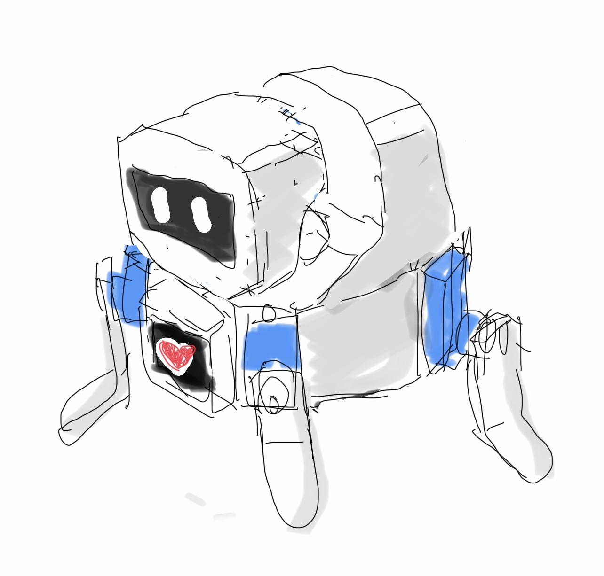

Concept picture by ChatGPT based on my schetch.

[3D design]  
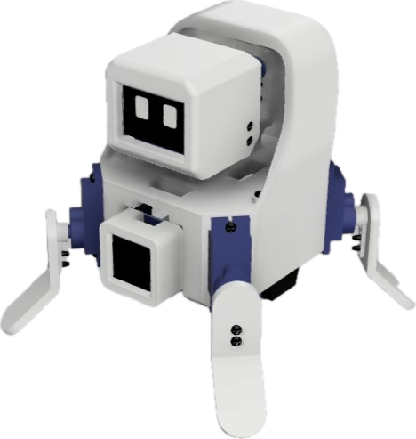
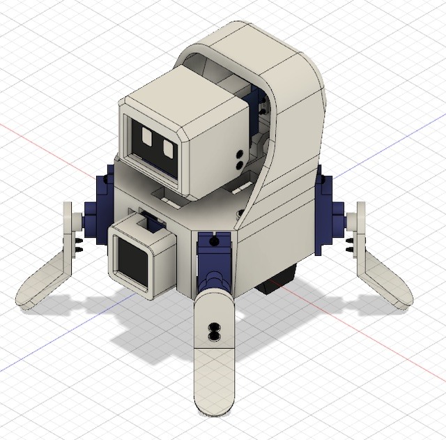
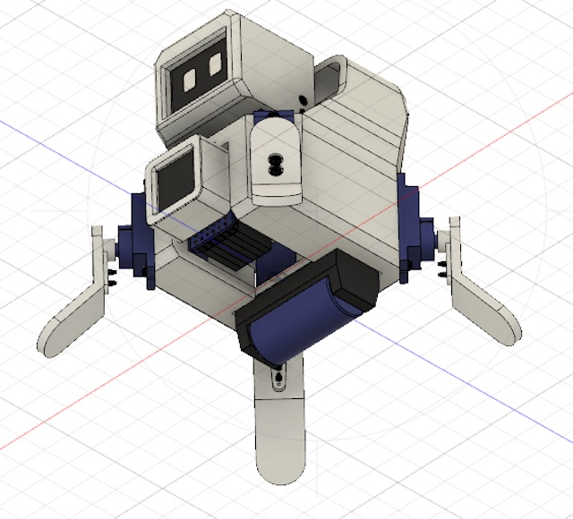
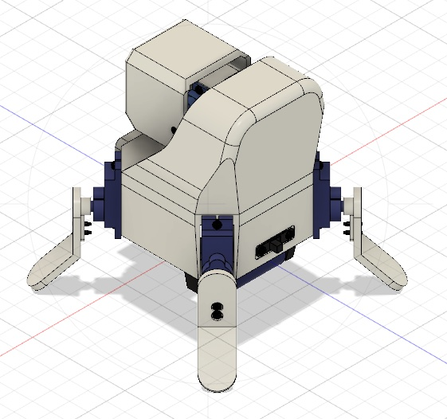

[3D printing and Assembling]  
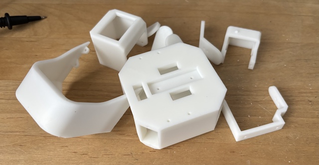
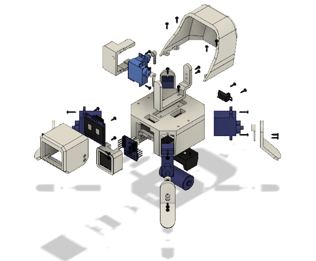

[Connection]  
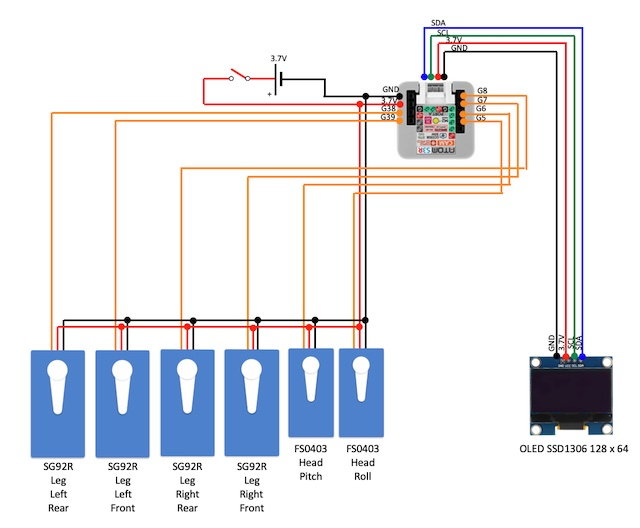

[Control by M5Cardputer]  
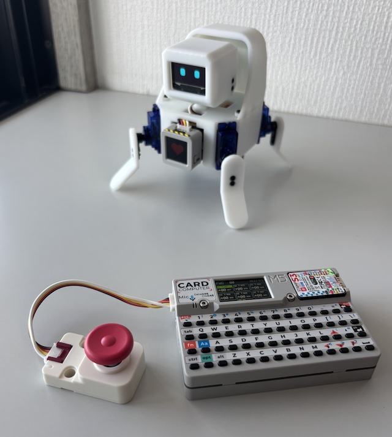
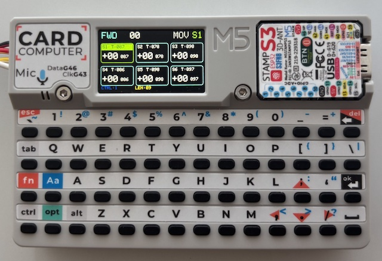

[How to use]  

- F	Forward  
- C	Back  
- V	Right  
- X	Left
- G	Right Turn  
- D	Left Turn  

Servo Edit
- Select Servo
   `[` : Previous Servo
   `]` : Next Servo
- Adjust Value
   + : Increase
   - : Decrease
  (Hold the key for faster adjustment.)  

- Trim Mode  
  T : Toggle Trim Mode  
  Modes:  
   MOV = Motion Offset Edit
   TRM = Servo Trim Edit

- Step Control
  , : Previous Step
  . : Next Step

Motion Length  
  < : Shorter Motion  
  > : Longer Motion  

- Save  
  S : Save all data to SD Card  
   Saved data:  
   Motion data  
   Trim values  
   Motion lengths  
   Joystick Modes  

- Press the joystick button to switch modes.  
  CTRL:1  
    Up → Forward  
    Down → Back  
    Right → Right Turn  
    Left → Left Turn  
  CTRL:2  
    Up → Forward  
    Down → Back  
    Right → Right  
    Left → Left  
  JOY:DIRECT
    Direct servo control (Head Control):
    X Axis → Servo 1
    Y Axis → Servo 2  

[Face]  
Normal  
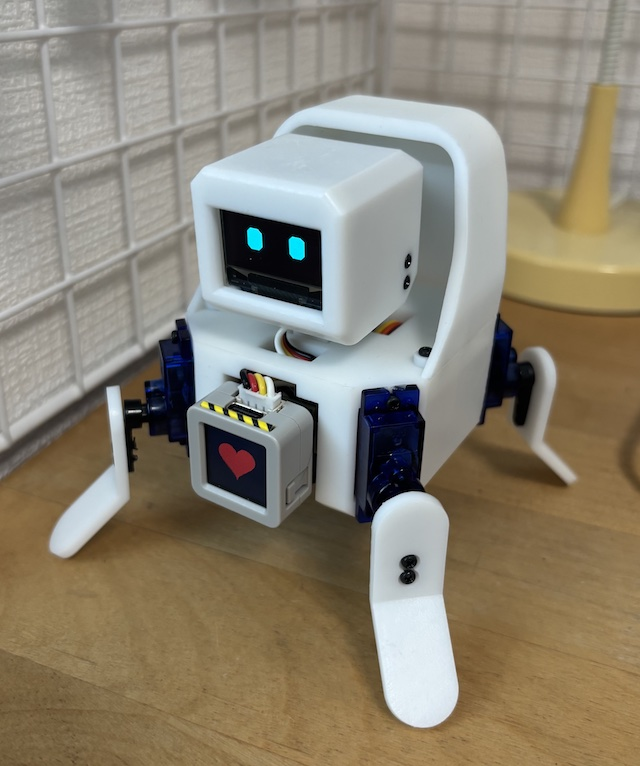
  
Smile  
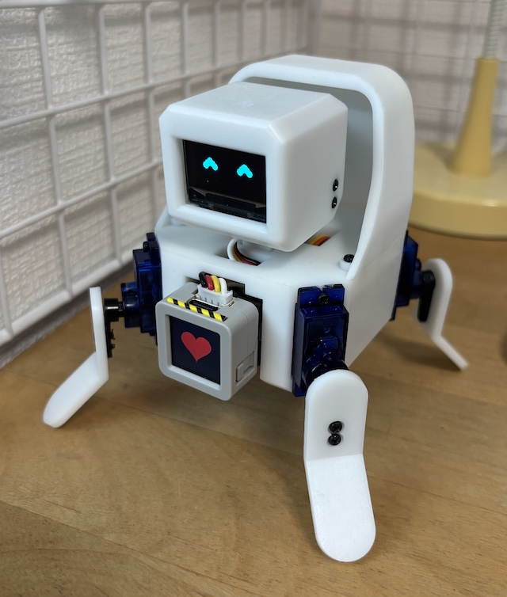

[Code]  
M5AtomS3R  
 NX28_M5AtomS3R  
M5Cardputer  
 NX27_M5Cardputer  
